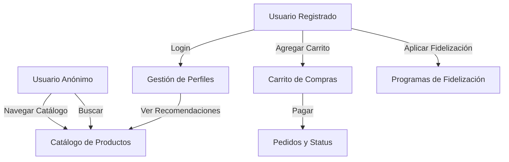

# Especificación de Requisitos de Software

**Proyecto:** Plataforma E-commerce PowerFit  
**Versión:** 1.0  
**Fecha:** 15/10/2025  

**Integrantes:**  

- Marcelo Rivera  
- Sebastian Novoa  

**Estándar de IEEE 830**  

Los párrafos a lo más de hasta 4 líneas.  
No escribir en los puntos que tengan subpuntos.  
Cuestiones específicas, a lo más de hasta 2 líneas, utilizar viñeta.  

## Contenido

CONTROL DE VERSIONES ........................................................................................................................................................................ 3  

1. INTRODUCCIÓN ................................................................................................................................................................................. 4  
1.1. PROPÓSITO ............................................................................................................................................................................................................................................................... 4  
1.2. ÁMBITO DEL SISTEMA .................................................................................................................................................................................................................................................. 4  

2. DESCRIPCIÓN GENERAL .................................................................................................................................................................. 6  
2.1. PERSPECTIVA DEL PRODUCTO ........................................................................................................................................................................................................................................ 6  
2.2. FUNCIONES DEL PRODUCTO .......................................................................................................................................................................................................................................... 6  
2.3. CARACTERÍSTICAS DE LOS USUARIOS ............................................................................................................................................................................................................................... 6  
2.4. RESTRICCIONES .......................................................................................................................................................................................................................................................... 7  
2.5. SUPOSICIONES Y DEPENDENCIAS .................................................................................................................................................................................................................................... 7  
2.6. REQUISITOS FUTUROS ................................................................................................................................................................................................................................................. 7  

3. REQUISITOS ESPECÍFICOS ............................................................................................................................................................... 9  
3.1 REQUISITOS COMUNES DE LAS INTERFACES ...................................................................................................................................................................................................................... 9  
3.1.1 Interfaces de usuario .................................................................................................................................................................................................................................... 9  
3.1.2 Interfaces de hardware ................................................................................................................................................................................................................................. 9  
3.1.3 Interfaces de software .................................................................................................................................................................................................................................. 9  
3.2 REQUISITOS FUNCIONALES ........................................................................................................................................................................................................................................... 9  
3.3 REQUISITOS NO FUNCIONALES (10 UNIDADES. ATRIBUTOS DE CALIDAD SEGÚN ISO 25010): ...................................................................................................................................................... 10  
3.4 OTROS REQUISITOS (2 UNIDADES, C/U A LO MÁS 2 LÍNEAS): ............................................................................................................................................................................................. 10  

## Control de Versiones

| Fecha       | Revisión | Autor   | Modificación                  |
|-------------|----------|---------|-------------------------------|
| 15/10/2025 | 1.0      | Equipo  | Inicio de construcción de ERS. |

## 1. Introducción

### 1.1. Propósito

El propósito de este documento ERS es detallar los requisitos funcionales y no funcionales para el desarrollo de la plataforma e-commerce PowerFit en Chile, dirigido a desarrolladores, stakeholders y equipo de proyecto para guiar la implementación, validación y pruebas unitarias del sistema.

### 1.2. Ámbito del Sistema

Nombre del Futuro Sistema: Plataforma E-commerce PowerFit

Lo que el Sistema Hará (5 unidades, c/u a lo más 2 líneas):  
✓ Permitir registro y autenticación de usuarios para acceso personalizado.  
✓ Ofrecer catálogo de suplementos con filtros por categoría y objetivos.  
✓ Gestionar carrito de compras con adición y modificación de productos.  
✓ Procesar pagos y mostrar status de pedidos.  
✓ Implementar fidelización con descuentos y recomendaciones.

Lo que el Sistema NO Hará (2 unidades, c/u a lo más 2 líneas):  
✓ No gestionará logística física de envíos ni inventarios reales.  
✓ No incluirá tracking en tiempo real de pedidos.

Beneficios, objetivos y/o metas que se espera alcanzar con el futuro sistema (5 unidades, c/u a lo más 2 líneas):  
✓ Posicionar PowerFit como líder en suplementos deportivos en Chile.  
✓ Mejorar experiencia usuario con interfaz responsiva y personalizada.  
✓ Aumentar retención mediante programas de puntos y promociones.  
✓ Asegurar calidad mediante pruebas unitarias en frontend.  
✓ Promover salud y bienestar en la comunidad fitness.

## 2. Descripción General

### 2.1. Perspectiva del Producto

PowerFit es un sistema e-commerce independiente para suplementos deportivos en Chile, con potencial integración futura a sistemas CRM o APIs de pagos. Se enfoca en experiencia integral, diferenciándose por recomendaciones basadas en objetivos fitness y pruebas unitarias para robustez.

### 2.2. Funciones del Producto

| Nombre de la Función          | Descripción de la Función                                                                 |
|-------------------------------|-------------------------------------------------------------------------------------------|
| Autenticación                 | Registrar y loguear usuarios vía email para seguridad.                                    |
| Gestión de Perfiles           | Editar datos y ver historial de pedidos con recomendaciones.                              |
| Catálogo de Productos         | Clasificar suplementos por categorías como proteínas y creatinas.                          |
| Búsqueda Avanzada             | Filtrar por marca, precio y objetivos fitness.                                            |
| Carrito de Compras            | Agregar, editar y eliminar ítems con cálculo de total.                                    |
| Procesamiento de Pagos        | Simular o integrar pagos con WebPay y PayPal.                                             |
| Status de Pedidos             | Mostrar estado actual de envíos sin real-time.                                            |
| Programas de Fidelización     | Acumular puntos y aplicar descuentos por compras.                                         |
| Promociones Especiales        | Ofrecer cupones en eventos deportivos.                                                    |
| Recomendaciones Personalizadas| Sugerir productos según historial y metas.                                                |

### 2.3. Características de los Usuarios

| Nombre del Usuario    | Nivel Educacional     | Experiencia Técnica          |
|-----------------------|-----------------------|------------------------------|
| Usuario Anónimo       | Enseñanza Media       | Navegación web básica.       |
| Usuario Registrado    | Enseñanza Media o Superior | Uso de e-commerce intermedio. |
| Cliente Frecuente     | Enseñanza Media o Superior | Familiaridad con apps móviles. |
| Administrador         | Enseñanza Superior    | Conocimientos en programación. |

### 2.4. Restricciones

✓ Desarrollo con React para frontend, Node.js/Express para backend, en Chile.  
✓ Pruebas unitarias obligatorias con Jasmine y Karma para componentes.

### 2.5. Suposiciones y Dependencias

✓ Integración con API backend para datos persistentes.  
✓ Dependencia de librerías como React Bootstrap y base de datos MongoDB.

### 2.6. Requisitos Futuros

✓ Agregar tracking en tiempo real vía websockets.  
✓ Integración con IA para recomendaciones avanzadas.

## 3. Requisitos Específicos

### 3.1 Requisitos comunes de las interfaces

#### 3.1.1 Interfaces de usuario

Interfaz minimalista con colores turquesa (#06D7B8), azul (#168AAD), gris (#2F2F2F), tipografías Bad Script/Vend Sans, imágenes de alta calidad y diseño mobile-first responsivo.

#### 3.1.2 Interfaces de hardware

Compatible con móviles, tablets, desktops; requiere servidores para backend y conexión internet en clientes.

#### 3.1.3 Interfaces de software

Frontend: React con Router y Bootstrap; Backend: Node.js, Express, MongoDB para BD; SO: Linux para servidores, multiplataforma para clientes.

### 3.2 Requisitos Funcionales

| Id. y Nombre Requerimiento | RF01 – Registro de Usuarios |
|----------------------------|-----------------------------|
| Descripción Requerimiento  | Registrar vía email con nombre, email y contraseña. |
| Comprobación Validez Entradas | Email: formato válido (string, max 50); Contraseña: min 8 chars. |
| Secuencia Exacta Operaciones | 1. Ingresar datos. 2. Validar. 3. Guardar en BD. 4. Confirmar. |
| Respuesta a situaciones anormales | Error si email existe o conexión falla. |
| Generación de Salidas     | Mensaje éxito y redirección. |

| Id. y Nombre Requerimiento | RF02 – Autenticación de Usuarios |
|----------------------------|----------------------------------|
| Descripción Requerimiento  | Verificar credenciales para login. |
| Comprobación Validez Entradas | Email y contraseña válidos. |
| Secuencia Exacta Operaciones | 1. Ingresar. 2. Validar vs BD. 3. Generar token. |
| Respuesta a situaciones anormales | Bloquear tras 5 intentos fallidos. |
| Generación de Salidas     | Sesión iniciada. |

| Id. y Nombre Requerimiento | RF03 – Gestión de Perfiles |
|----------------------------|----------------------------|
| Descripción Requerimiento  | Mostrar/editar datos y pedidos. |
| Comprobación Validez Entradas | Datos strings válidos. |
| Secuencia Exacta Operaciones | 1. Fetch de BD. 2. Mostrar. 3. Actualizar. |
| Respuesta a situaciones anormales | Redirigir si no autenticado. |
| Generación de Salidas     | Perfil actualizado. |

| Id. y Nombre Requerimiento | RF04 – Recomendaciones Personalizadas |
|----------------------------|---------------------------------------|
| Descripción Requerimiento  | Sugerir suplementos por objetivos. |
| Comprobación Validez Entradas | Objetivos de lista predefinida. |
| Secuencia Exacta Operaciones | 1. Obtener historial BD. 2. Generar sugerencias. |
| Respuesta a situaciones anormales | Sugerencias genéricas si no datos. |
| Generación de Salidas     | Lista recomendada. |

| Id. y Nombre Requerimiento | RF05 – Catálogo de Productos |
|----------------------------|------------------------------|
| Descripción Requerimiento  | Listar por categorías. |
| Comprobación Validez Entradas | Filtros: marca (string), precio (num). |
| Secuencia Exacta Operaciones | 1. Fetch productos BD. 2. Filtrar. |
| Respuesta a situaciones anormales | Mensaje sin resultados. |
| Generación de Salidas     | Grid productos. |

| Id. y Nombre Requerimiento | RF06 – Búsqueda Avanzada |
|----------------------------|---------------------------|
| Descripción Requerimiento  | Filtrar por fitness. |
| Comprobación Validez Entradas | Query min 3 chars. |
| Secuencia Exacta Operaciones | 1. Ingresar query. 2. Buscar en BD. |
| Respuesta a situaciones anormales | Sugerir alternativas. |
| Generación de Salidas     | Resultados. |

| Id. y Nombre Requerimiento | RF07 – Carrito de Compras |
|----------------------------|----------------------------|
| Descripción Requerimiento  | Gestionar ítems. |
| Comprobación Validez Entradas | Cantidad positivo. |
| Secuencia Exacta Operaciones | 1. Agregar. 2. Actualizar. 3. Guardar sesión. |
| Respuesta a situaciones anormales | Alertar stock bajo. |
| Generación de Salidas     | Carrito actualizado. |

| Id. y Nombre Requerimiento | RF08 – Procesamiento de Pagos |
|----------------------------|-------------------------------|
| Descripción Requerimiento  | Integrar métodos de pago. |
| Comprobación Validez Entradas | Tarjeta 16 dígitos. |
| Secuencia Exacta Operaciones | 1. Seleccionar. 2. Validar. 3. Procesar. |
| Respuesta a situaciones anormales | Reintentar fallo. |
| Generación de Salidas     | Confirmación. |

| Id. y Nombre Requerimiento | RF09 – Status de Pedidos |
|----------------------------|---------------------------|
| Descripción Requerimiento  | Mostrar estado actual de pedidos. |
| Comprobación Validez Entradas | ID pedido numérico. |
| Secuencia Exacta Operaciones | 1. Fetch de BD. 2. Mostrar status. |
| Respuesta a situaciones anormales | Mensaje si no encontrado. |
| Generación de Salidas     | Detalle de status. |

| Id. y Nombre Requerimiento | RF10 – Programas de Fidelización |
|----------------------------|-----------------------------------|
| Descripción Requerimiento  | Acumular puntos y descuentos. |
| Comprobación Validez Entradas | Valor compra positivo. |
| Secuencia Exacta Operaciones | 1. Calcular puntos. 2. Aplicar. |
| Respuesta a situaciones anormales | Ignorar si no elegible. |
| Generación de Salidas     | Total con descuento. |

### 3.3 Requisitos no Funcionales (10 unidades. Atributos de Calidad según ISO 25010)

| Id.   | Nombre Corto       | Descripción                                                                 | Atributo de Calidad |
|-------|--------------------|-----------------------------------------------------------------------------|---------------------|
| RNF01 | Rendimiento        | Carga < 2 seg en conexiones estándar.                                       | Eficiencia          |
| RNF02 | Usabilidad         | Interfaz intuitiva mobile-first.                                            | Usabilidad          |
| RNF03 | Integridad         | Asegurar datos no se alteren sin autorización.                              | Seguridad           |
| RNF04 | Accesibilidad      | Cumplir WCAG 2.1 con alt text.                                              | Accesibilidad       |
| RNF05 | Mantenibilidad     | Código modular reutilizable.                                                | Mantenibilidad      |
| RNF06 | Portabilidad       | Compatible múltiples dispositivos.                                          | Portabilidad        |
| RNF07 | Confiabilidad      | Manejo errores sin fallos.                                                  | Confiabilidad       |
| RNF08 | Eficiencia Recursos| Bajo consumo en móviles.                                                    | Eficiencia          |
| RNF09 | Interoperabilidad  | Integración APIs pagos.                                                     | Interoperabilidad   |
| RNF10 | Compatibilidad     | Soporte React y Node.js recientes.                                          | Compatibilidad      |

### 3.4 Otros Requisitos (2 unidades, c/u a lo más 2 líneas)

✓ Cumplir Ley 19.628 de protección datos en Chile.  
✓ Implementar pruebas unitarias con Jasmine/Karma para frontend.

## 4. Apéndices

### 4.1 Diagramas

#### 4.1.1 Diagrama de Casos de Uso



#### 4.1.2 Diagrama de Flujo de Navegación

```mermaid
flowchart LR
    Home[/] -->|Login| Login[/login]
    Home -->|Registro| Registro[/register]
    Home -->|Catálogo| Catalogo[/products]
    Catalogo -->|Detalle| Detalle[/product/:id]
    Usuario[/profile] -->|Pedidos| Pedidos[/orders]
    Carrito[/cart] -->|Checkout| Checkout[/checkout]
    Checkout -->|Éxito| Exito[/success]
```

#### 4.1.3 Diagrama de Componentes

```mermaid
classDiagram
    App --> Header
    App --> Footer
    App --> Router
    Router --> HomePage
    Router --> LoginPage
    Router --> ProfilePage
    Router --> ProductsPage
    Router --> CartPage
    ProductsPage --> ProductCard
    ProfilePage --> RecommendationsList
    CartPage --> PaymentForm
    Server --> APIEndpoints
    APIEndpoints --> Database[MongoDB]
```
